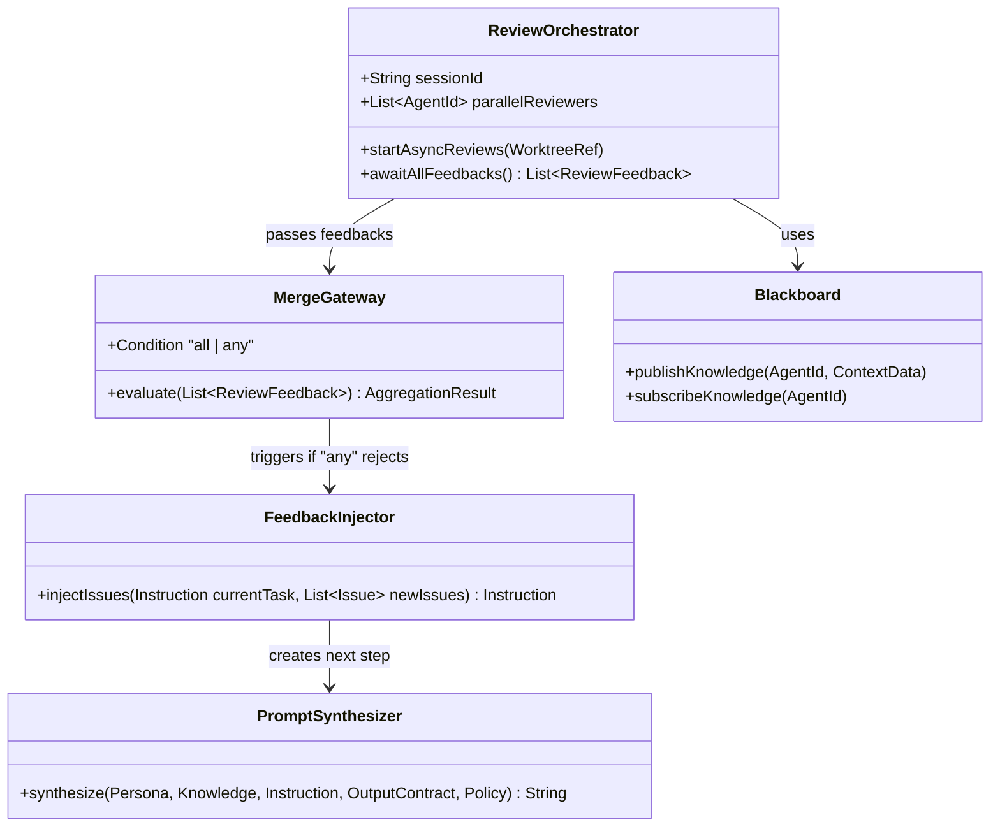

# Kanon アーキテクチャ (Architecture)

Kanonは、音楽の「カノン（対位法）」から着想を得たAI開発オーケストレーション・システムです。LLMに「次に何をすべきか」を自律的に考えさせる従来のアプローチを廃し、有限オートマトンによる状態遷移に基づく**「決定論的オーケストレーション」**を採用しています。

本ドキュメントでは、Kanonのコア・アーキテクチャ原則とクラス設計の概要を定義します。

## 1. コア・アーキテクチャ原則

### A. Faceted Prompting（プロンプト工学への「関心の分離」）

LLMへの入力はモノリシックにせず、以下の5つのファセット（独立したファイルまたはオブジェクト）に分割して管理・合成します。

1. **Persona (Who):** エージェントの役割と専門性（例: Security Reviewer）。
2. **Policy (Rules):** プロジェクト全体の禁止事項や品質基準。
3. **Instruction (What):** 該当ステップの具体的な指示。
4. **Knowledge (Context):** 参照すべきドメイン知識やアーキテクチャ定義。
5. **Output Contract (How):** 出力フォーマットの指定。

> [!IMPORTANT]
> **Recency Effect（新近性効果）の活用**
> 動的合成の際は必ず `Policy`（REJECT基準など最も守らせたい制約）をプロンプトの最末尾に配置するアルゴリズムとします。

### B. 決定論的ルーティングとAggregate（集約）条件

エージェントに状態遷移の判断を委ねず、フレームワーク側（YAML定義など）が有限オートマトン（FSM）として振る舞い、次のアクションを決定します。
並列実行されるサブタスクの結果を評価し、`all`（全て承認でマージ）や `any`（一つでもエラーがあれば差し戻し）といった条件でルーティングを制御する「マージ・ゲートウェイ（Aggregate条件）」を実装します。

### C. Context Synchronization（文脈同期）

並行して走る複数のエージェント（実装、アーキテクチャレビュー、セキュリティ等）の出力をリアルタイムに共有Knowledgeとして統合します。これを後続あるいは並行する別エージェントが即座に参照できる「共有黒板モデル（Blackboard Pattern）」のデータバスで設計します。

### D. 実行環境の完全な隔離（サンドボックス化）

エージェントによる自律的なコード編集が既存環境を破壊しないよう、Git Worktreeなどを利用してタスクごとに完全に隔離された一時環境（Isolated Environment）を生成します。検証プロセス（COMPLETE）を通過した後にのみメインリポジトリへコミット・PRを作成します。

---

## 2. ディレクトリ構造とドメイン設計

Kanonのコア・エンジンは、ドメイン駆動設計（DDD）およびクリーンアーキテクチャの思想に基づいて構成されます。

```text
kanon/
├── src/
│   ├── domain/                 # ビジネスロジック・ドメインモデル（外部依存なし）
│   │   ├── models/
│   │   │   ├── promptFacet.ts  # Facet モデル (Persona, Policy, Instruction 等)
│   │   │   ├── agentState.ts   # エージェントコンテキスト・状態
│   │   │   ├── feedback.ts     # レビュー結果・指摘事項
│   │   │   └── fsmNode.ts      # 有限オートマトン（FSM）定義
│   │   ├── repositories/       # リポジトリのインターフェース
│   │   │   ├── blackboard.ts   # 共有黒板 (Context Synchronization)
│   │   │   └── sandbox.ts      # 隔離環境 (Git Worktree 等)
│   │   └── services/           # ドメインサービス
│   │       └── mergeGateway.ts # all/any条件に基づくフィードバック集約ロジック
│   │
│   ├── usecases/               # アプリケーションユースケース
│   │   ├── orchestration/
│   │   │   └── transitionEngine.ts  # 決定論的ルーティング・状態遷移エンジン
│   │   ├── prompt/
│   │   │   ├── synthesizer.ts       # Faceted Prompting合成器
│   │   │   └── feedbackInjector.ts  # 差し戻し時のInstruction合成ロジック
│   │   └── environment/
│   │       └── worktreeManager.ts   # Git Worktreeの構築・破棄
│   │
│   ├── infrastructure/         # 外部システム（Git, LLM, Redis等）との連携実装
│   │   ├── git/
│   │   │   └── localGitSandbox.ts   # Git Worktreeコマンド実行
│   │   ├── llm/
│   │   │   └── multiLlmClient.ts    # AIモデル呼び出し
│   │   ├── contextBus/
│   │   │   └── redisBlackboard.ts   # 共有黒板データバス実装
│   │   └── config/
│   │       └── yamlWorkflowParser.ts# FSMルールの読み出し
│   │
│   └── interfaces/             # ユーザーインターフェースやAPI
│       └── cli/
```

---

## 3. 並行修正ループのクラス設計

複数のレビュアーエージェントが非同期に検証を行い、フィードバックを集約して実装エージェントへ差し戻すフローの設計図です。



### 状態遷移とコンテキスト合成のフロー

1. **並列レビュー開始:** `ReviewOrchestrator` が対象Worktreeに対して複数のレビュアーエージェントを非同期に起動します。
2. **動的文脈同期:** 発見された課題は即座に `Blackboard` に書き込まれ、他エージェントのレビュー判断材料として共有されます。
3. **集約判定:** `MergeGateway` が全ての結果を収集し、定義された条件（all/any）で評価します。一つでもREJECTがあれば差し戻しとみなします。
4. **差し戻しInstructionの合成:** `FeedbackInjector` が元のInstructionに指摘事項（Issues）を合成し、`PromptSynthesizer` が次のプロンプトを生成して実装エージェントへ再指示します。
