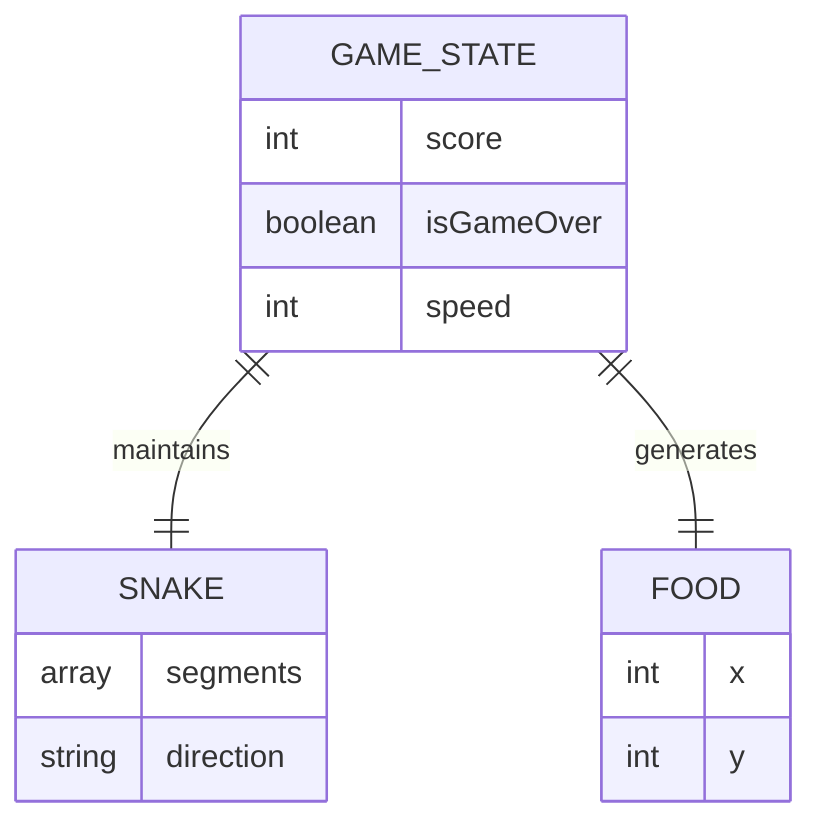
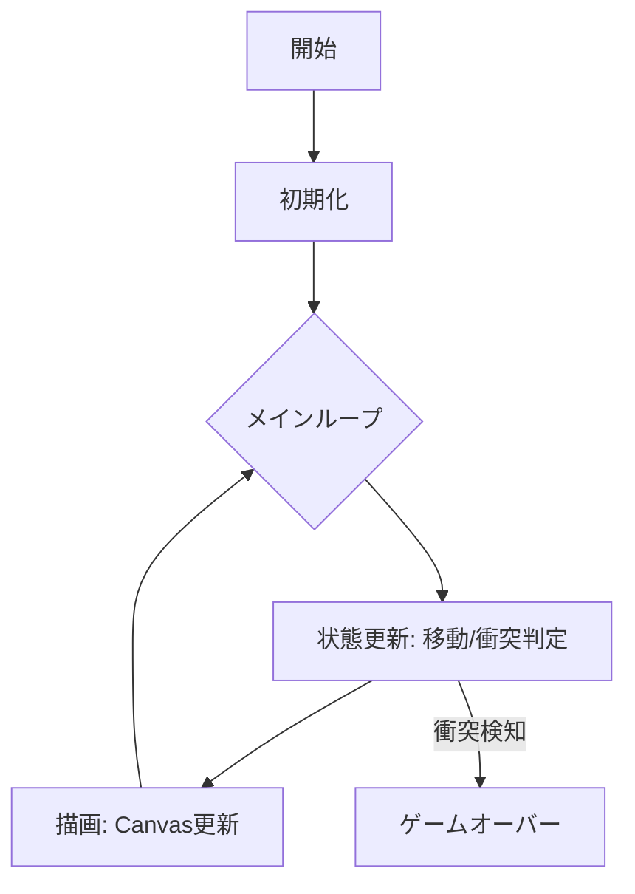

# DESIGN.md - スネークゲーム (Snake Game)

## Architecture Overview
単一のHTMLファイル（index.html）と、ロジックを分離したJavaScriptファイル（game.js）、スタイリング用のCSSファイル（style.css）の構成とします。
Canvas APIを使用してゲーム画面を描画します。

## Data Model
ゲームの状態は以下のオブジェクトで管理します。

## API Interface
Webクライアントサイド完結のため、外部APIは使用しません。

## Algorithms / Logic

### メインループ

### 移動ロジック
1. 入力待ち（キーボードイベント）。
2. 前回の方向と逆方向への入力を無視するガード処理。
3. 次の頭の位置を算出。
4. エサの判定:
    - 頭がエサと同じ位置なら、体を短くせずにスコア加算、新しいエサを配置。
    - そうでなければ、末尾を削除（移動を表現）。

## Tech Stack
- **HTML5**: 構造とCanvasの提供。
- **CSS3**: ブラウザ中央配置、タイポグラフィ、プレミアムなUIデザイン（グラスモーフィズム）。
- **JavaScript (ES6+)**: ゲームロジック、Canvas API操作。
