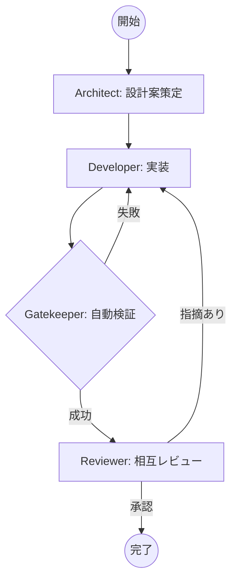

# AIエージェントの合奏（Kanon）が、開発を「全自動」から「完全自律」へ変える

こんにちは、Antigravityを活用して開発効率の限界に挑戦しているリードエンジニアの皆さん。

私たちは今、大きな転換点に立っています。AIがコードの断片を書く時代は終わり、AIが**「仕様策定から実装、そしてテストを通すまで」を自律的に完結させる時代**がやってきました。

その中心にあるのが、AIエージェント・オーケストレーションツール **「Kanon（カノン）」** です。

## 開発のボトルネックは「生成」ではなく「検証」にある

LLMによるコーディング支援は劇的に進化しました。しかし、多くのリードエンジニアが直面している課題は、AIが「もっともらしいが動かないコード」を生成すること、そしてその修正やテスト、レビューに結局人間が多大な工数を割いていることです。

Kanonは、この「生成後の空白」を埋めるために設計されました。

## Kanonの核心：決定論的オーケストレーション

Kanonの最大の特徴は、AIエージェントに「次に何をすべきか」を委ねない、**決定論的オーケストレーション**にあります。

従来の多くのエージェントシステムは、LLM自身にアクションを選択させます。しかし、これには不安定さが伴います。Kanonは、音楽の「カノン」が厳格な規則（対位法）に基づいて模倣を繰り返すように、**有限オートマトン（FSM）**による厳密な状態遷移で開発プロセスを制御します。



このフローにおいて、エージェントは「そのフェーズの専門家」として振る舞うだけでよく、全体の舵取りはKanonエンジンが決定論的に行います。

## 高品質なコードを生む「Faceted Prompting」

Kanonは、プロンプト工学に「関心の分離」を持ち込みました。LLMへの指示を以下の5つのファセットに分割して管理します。

1. **Persona (Who)**: エージェントの専門性と役割定義
2. **Policy (Rules)**: 禁止事項や品質基準（最優先事項）
3. **Instruction (What)**: 実行すべき具体的なタスク
4. **Knowledge (Context)**: 参照すべきドメイン知識や既存コード
5. **Output Contract (How)**: 期待される出力形式（JSON, Markdown等）

特に注目すべきは**Policy（ポリシー）**の扱いです。Kanonは動的にプロンプトを合成する際、新近性効果（Recency Effect）を最大化するため、ポリシーをプロンプトの最末尾に配置します。これにより、「セキュリティ要件を無視しない」「テストをスキップしない」といった重要な制約をAIに徹底させます。

## 自律修正ループ（Self-Correction Loop）

Kanonの真骨頂は、`kanon execute` コマンドによる自律実装フェーズにあります。

実装エージェントがコードを書き終えると、即座に**Gatekeeper（門番）**が起動します。Gatekeeperはプロジェクトのコンテキストを解析し、ビルドやテストに必要なコマンドを自律的に生成・実行します。

エラーが発生した場合、そのログは即座にフィードバックとして実装エージェントに差し戻されます。人間が介入することなく、AIが「自分で書いたコードを自分でテストし、エラーを見て自分で直す」というループが、最大リトライ回数に達するか、全てのテストをパスするまで繰り返されます。

## リードエンジニアのための「安全な遊び場」

自律型AIにコードを任せる不安を解消するため、Kanonは以下の機能を備えています。

- **Git Worktreeによる環境隔離**: タスクごとに専用の作業ツリーを作成。既存のブランチを汚す心配はありません。
- **Antigravity ダッシュボード**: 進行状況、エージェント間のチャット、実行ログをVS Codeのサイドバーでリアルタイムにモニタリング可能。
- **Walkthrough生成**: 作業完了後、AIが「何を変え、なぜそうしたか」をまとめた報告書を自動生成します。

## 結論：エンジニアは「何を作るか」の定義に集中できる

Kanonの導入によって、リードエンジニアの役割は「コードを書くこと」や「単純なシンタックスエラーを指摘すること」から、**「品質ポリシー（Policy）を定義し、設計（Architect）をレビューすること」**へとシフトします。

AIエージェントの「合奏」を指揮する指揮者（Conductor）として、より創造的で高次なエンジニアリングに集中できる。そんな未来がKanonと共に始まっています。

---

**今すぐKanonを体験する**
```bash
npm install -g @kanon-ag/cli
kanon init
kanon run --task="新しいユーザー認証フローを実装し、テストを追加して"
```

あなたのプロジェクトで、AIの真のオーケストレーションを体験してください。
